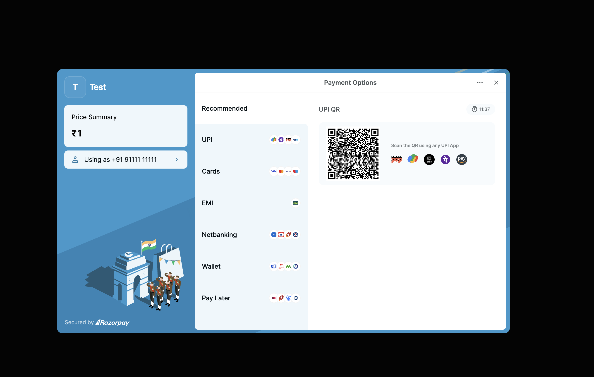
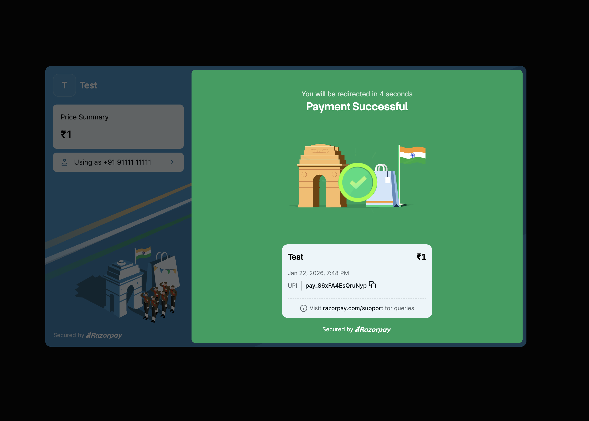

# 💳 Razorpay Payment Integration with Next.js

A modern, production-ready payment integration demo built with **Next.js 15**, **Razorpay**, and deployed on **Cloudflare Workers** using OpenNext. This project demonstrates secure payment processing with a clean, responsive UI and seamless user experience.

## 🚀 Live Demo

**[View Live Demo →](https://razorpay-next-app.bhaskarg.workers.dev/)**

## 📸 Screenshots

<table>
  <tr>
    <td align="center"><b>Homepage</b></td>
    <td align="center"><b>Payment Initialization</b></td>
    <td align="center"><b>Payment Completed</b></td>
  </tr>
  <tr>
    <td></td>
    <td></td>
    <td></td>
  </tr>
</table>

## ✨ Features

- ✅ **Secure Payment Processing** - Integration with Razorpay's payment gateway
- ✅ **Modern UI/UX** - Clean, responsive design with smooth animations
- ✅ **Real-time Feedback** - Loading states and interactive button effects
- ✅ **Edge Deployment** - Deployed on Cloudflare Workers for global low-latency
- ✅ **Type-Safe** - Built with TypeScript for robust code quality
- ✅ **Server-Side Order Creation** - Secure API routes for payment order generation
- ✅ **Responsive Design** - Works seamlessly across all device sizes

## 🛠️ Tech Stack

- **Framework:** [Next.js 15](https://nextjs.org/) (App Router)
- **Runtime:** [React 19](https://react.dev/)
- **Payment Gateway:** [Razorpay](https://razorpay.com/)
- **Styling:** [Tailwind CSS 4](https://tailwindcss.com/)
- **Deployment:** [Cloudflare Workers](https://workers.cloudflare.com/) via [OpenNext](https://opennext.js.org/)
- **Language:** [TypeScript](https://www.typescriptlang.org/)
- **Package Manager:** Bun / npm

## 🏗️ Project Structure

```
razorpay-next-app/
├── src/
│   └── app/
│       ├── api/
│       │   └── create-order/
│       │       └── route.ts          # API endpoint for order creation
│       ├── globals.css               # Global styles
│       ├── layout.tsx                # Root layout
│       └── page.tsx                  # Homepage with payment button
├── public/                           # Static assets & screenshots
├── package.json
├── tsconfig.json
├── wrangler.jsonc                    # Cloudflare configuration
└── README.md
```

## 🚦 Getting Started

### Prerequisites

- Node.js 18+ or Bun
- Razorpay account ([Sign up here](https://razorpay.com/))
- Cloudflare account (for deployment)

### Installation

1. **Clone the repository**
   ```bash
   git clone https://github.com/yourusername/razorpay-next-app.git
   cd razorpay-next-app
   ```

2. **Install dependencies**
   ```bash
   npm install
   # or
   bun install
   ```

3. **Set up environment variables**

   Create a `.env` file in the root directory:
   ```env
   NEXT_PUBLIC_RAZORPAY_KEY_ID=your_razorpay_key_id
   ```

   Create a `.dev.vars` file for local Cloudflare development:
   ```env
   RAZORPAY_KEY_ID=your_razorpay_key_id
   RAZORPAY_KEY_SECRET=your_razorpay_key_secret
   ```

   > **Note:** Get your API keys from [Razorpay Dashboard](https://dashboard.razorpay.com/app/keys)

4. **Run the development server**
   ```bash
   npm run dev
   # or
   bun dev
   ```

   Open [http://localhost:3000](http://localhost:3000) to view the app.

## 📦 Deployment

### Deploy to Cloudflare Workers

1. **Build and deploy**
   ```bash
   npm run deploy
   # or
   bun run deploy
   ```

2. **Set environment variables in Cloudflare**
   ```bash
   npx wrangler secret put RAZORPAY_KEY_ID
   npx wrangler secret put RAZORPAY_KEY_SECRET
   ```

### Preview locally with Cloudflare runtime
```bash
npm run preview
# or
bun run preview
```

## 🔐 Security Best Practices

- ✅ API keys are stored securely in environment variables
- ✅ Payment order creation happens server-side
- ✅ Amount validation on the backend
- ✅ Unique receipt IDs generated using nanoid
- ✅ HTTPS-only in production

## 🎨 Key Implementation Details

### Payment Flow

1. User clicks "Pay Now" button
2. Frontend sends amount to `/api/create-order`
3. Server creates a Razorpay order with unique receipt ID
4. Razorpay checkout modal opens with order details
5. User completes payment
6. Payment success handler is triggered

### API Route (`/api/create-order`)

```typescript
// Secure server-side order creation
const order = await razorpay.orders.create({
  amount: amount,        // in paise
  currency: "INR",
  receipt: "receipt_" + nanoid(8)
});
```

### Frontend Integration

```typescript
// Razorpay checkout initialization
const rzp1 = new window.Razorpay({
  key: process.env.NEXT_PUBLIC_RAZORPAY_KEY_ID,
  amount: order.amount,
  currency: "INR",
  order_id: orderId,
  handler: () => console.log("Payment successful!")
});
rzp1.open();
```

## 📝 Available Scripts

| Command | Description |
|---------|-------------|
| `npm run dev` | Start development server with Turbopack |
| `npm run build` | Build for production |
| `npm run start` | Start production server |
| `npm run lint` | Run ESLint |
| `npm run preview` | Preview with Cloudflare runtime locally |
| `npm run deploy` | Build and deploy to Cloudflare Workers |
| `npm run cf-typegen` | Generate Cloudflare environment types |

## 🤝 Contributing

Contributions, issues, and feature requests are welcome! Feel free to check the [issues page](https://github.com/yourusername/razorpay-next-app/issues).

## 📄 License

This project is open source and available under the [MIT License](LICENSE).

## 👨‍💻 Author

**Bhaskar G**

- Portfolio: [bhaskar.guthula.cc](https://bhaskar.guthula.cc)
- GitHub: [@Shisui-Genjutsu](https://github.com/Shisui-Genjutsu)
- LinkedIn: [LinkedIn](https://www.linkedin.com/in/bhaskar-rama-suresh-guthula-38162519b/)

## 🙏 Acknowledgments

- [Razorpay Documentation](https://razorpay.com/docs/)
- [Next.js Documentation](https://nextjs.org/docs)
- [OpenNext Cloudflare](https://opennext.js.org/cloudflare)

---

<div align="center">
  <sub>Built with ❤️ using Next.js and Razorpay</sub>
</div>
